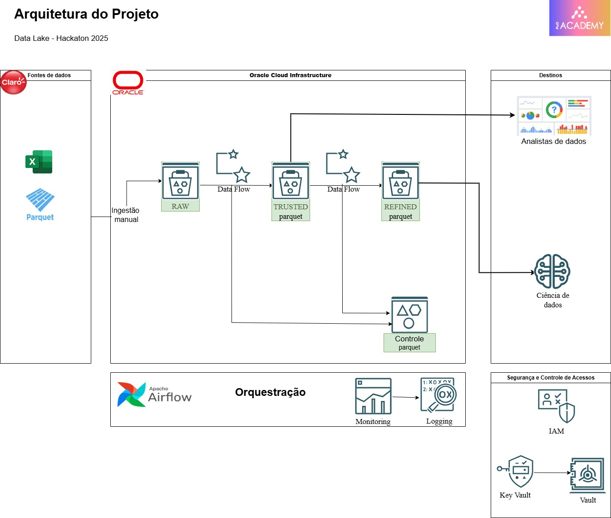

<p align="center">
  
</p>

# Hackathon POD 2025 – Análise de Migração Pré → Pós-Pago

<p align="center">
  <strong>Projeto de Data Science com foco em risco de inadimplência e migração segura de clientes</strong>
</p>

---

## 📌 Visão Geral

Este projeto foi desenvolvido no contexto do **Hackathon POD 2025** com o objetivo de identificar clientes de planos **pré-pagos** com potencial de migração segura para planos **pós-pagos**, minimizando o risco de inadimplência.

O pipeline contempla todas as etapas essenciais de um projeto de dados em ambiente corporativo real, desde ingestão e tratamento até modelagem e avaliação.

---

## 🎯 Objetivo do Projeto

Desenvolver um **modelo de classificação** para prever **First Payment Default (FPD)**:

<ul>
  <li><strong>FPD = 0</strong> → Bom pagador</li>
  <li><strong>FPD = 1</strong> → Inadimplente</li>
</ul>

A fim de apoiar decisões mais seguras na migração de clientes do plano pré-pago para o pós-pago.

---

## 🧰 Tecnologias Utilizadas

- Python 3.10+
- Pandas
- NumPy
- PySpark
- Scikit-learn
- PyCaret
- Jupyter Notebook
- Parquet
- AWS S3 (camada Trusted – ambiente produtivo)

---

## 🗂 Estrutura do Repositório

```text
hackathon_pod_2025/
│
├── ciencia/
│   ├── artifact/                # Artefatos intermediários (não versionados)
│   ├── configs/
│   ├── notebooks/
│   │   ├── 01_entendimento_dados.ipynb
│   │   ├── 02_tratamento_dados.ipynb
│   │   ├── 03_regra_negocio.ipynb
│   │   └── 04_baseline_pycaret.ipynb
│   ├── data/
│   │   ├── raw/                 # Dados brutos (NÃO versionados)
│   │   ├── processed/
│   │   └── predictions/
│   ├── models/
│   ├── reports/metrics/
│   ├── DIVISAO_TEMPORAL.md
│   └── requirements.txt
│
├── engenharia/
│   ├── book_01.ipynb
│   ├── book_02.ipynb
│   └── book_03.ipynb
│   └── book_04.ipynb
│   └── Book_Pagamento_05.ipynb
│   └── book_atraso_06.py
│
├── data_notebooks/
│   └── exploratory/
│   └── processed/
│       ├── local_test/
│       └── trusted/
│
├── src/pipeline/
│   └── trusted
└── README.md
```
---

## 🔒 Dados Sensíveis

⚠️ <strong>Os dados utilizados neste projeto NÃO estão disponíveis neste repositório,</strong> pois contêm informações sensíveis e confidenciais.

Este repositório disponibiliza apenas:
<ul>
  <li>Código-Fonte</li>
  <li>Estrutura do projeto</li>
  <li>Pipeline de processamento</li>
  <li>Documentação técnica</li>
</ul>

A execução do projeto pressupõe que o usuário <strong>já possua acesso autorizado aos dados originais</strong>.

---

## 📂 Estrutura Esperada dos Dados

Os dados devem ser organizados localmente conforme a estrutura abaixo:

```text
ciencia/data/
└──raw/
    └──base_cadastral.parquet
```

#### Requisitos mínimos do dataset
<ul>
<li>Período: SAFRA 202410 a 202503</li>
<li>Variável target: <strong>FPD</strong></li>
<li>Identificador único do cliente (ex:<strong>NUM_CPF</strong>)</li>
<li>Variáveis cadastrias, comportamanetias e temporais</li>
</ul>

---

## ⏳ Divisão Temporal (Ponto Crítico)

Este projeto <strong>não utiliza divisão aleatória dos dados.</strong>

A separação entre treino e teste é realizada por <strong>SAFRA</strong>, simulando fielmente um cenário de produção:

Conjunto de Treino
<ul>
<li>SAFRA 202410</li>
<li>SAFRA 202411</li>
<li>SAFRA 202412</li>
<li>SAFRA 202501</li>
</ul>

Conjunto de Teste
<ul>
<li>SAFRA 202502</li>
<li>SAFRA 202503</li>
</ul>

Benefícios dessa abordagem
<ul>
<li>Evita data leakage</li>
<li>Simula predições em dados futuros</li>
<li>Permite detecção de drift temporal</li>
<li>Garante avaliação realista do modelo</li>
</ul>

---
## ▶️ Como Executar o Projeto

#### 1️⃣ Clonar o repositório
```bash
git clone https://github.com/seu-usuario/hackathon_pod_2025.git
cd hackathon_pod_2025
```
#### 2️⃣ Criar e ativar ambiente virtual
```bash
python -m venv venv
source venv/bin/activate    # Linux / Mac
venv\Scripts\activate       # Windows
```
#### 3️⃣ Instalar dependências
```bash
pip install -r ciencia/requirements.txt

```
#### 4️⃣ Inserir os dados sensíveis
Copie os arquivos autorizados para o diretório:
```bash
ciencia/data/raw/

```
#### 5️⃣ Executar os notebooks (ordem obrigatória)
1. `01_entendimento_dados.ipynb`
2. `02_tratamento_dados.ipynb`
3. `03_regra_negocio.ipynb`
4. `04_baseline_pycaret.ipynb`

---

## 🏗 Arquitetura de Dados

O projeto segue a Medallion Architecture, organizada em três camadas:

<ul> <li><strong>Raw</strong>: dados brutos, sem transformações</li> 
<li><strong>Trusted</strong>: dados limpos, padronizados e validados</li> <li><strong>Refined</strong>: dados enriquecidos e prontos para consumo analítico e modelagem</li> </ul>

---

## 🏗 Arquitetura do Projeto

A arquitetura apresentada reflete as decisões técnicas e de engenharia
documentadas pela **Squad 01**, com foco na ingestão, organização,
governança e disponibilização dos dados para análises e ciência de dados.

<p align="center">
  
</p>

<p align="center">
  <em>Arquitetura de Data Lake e Pipeline Analítico utilizada no Hackathon POD 2025</em>
</p>

### Visão Geral da Arquitetura


A solução foi implementada sobre um **Data Lake em Oracle Cloud Infrastructure (OCI)**,
seguindo princípios de arquitetura em camadas e separação de responsabilidades.

O fluxo de dados contempla:
- Ingestão manual de múltiplas fontes (Excel, Parquet e bases internas)
- Persistência em camada **RAW**
- Processamentos orquestrados via **Apache Airflow**
- Evolução dos dados para camadas **TRUSTED** e **REFINED**
- Disponibilização para **analistas de dados** e **cientistas de dados**

Controles de segurança, acesso, monitoramento e logging são aplicados
em todas as etapas do pipeline.

Os detalhes técnicos completos da arquitetura, bem como as decisões
de engenharia adotadas, estão descritos na documentação técnica
referenciada ao final deste README.


--- 

## 📊 Boas Práticas Aplicadas

<ul>
<li>Arquitetura de dados em camadas</li>
<li>Processamento distribuído com PySpark</li>
<li>Divisão temporal por SAFRA</li>
<li>Versionamento de código</li>
<li>Logs e rastreabilidade de processamento</li>
<li>Uso de Parquet para performance e compressão</li>
</ul>

---

## 📄 Documentação Técnica Completa
A documentação detalhada do pipeline, decisões metodológicas e implementação está disponível e poderá ser solicitada no link abaixo:

📘 [Documentação Técnica Completa](https://link-do-arquivo)


---

## 🧠 Observação Final
Este projeto foi desenvolvido com foco em <strong>ambiente corporativo real,</strong> respeitando princípios de:
<ul>
<li>Governança de dados</li>
<li>Segurança de informação</li>
<li>Reprodutibilidade</li>
<li>Validação estatística</li>
<li>Boas práticas de Data Science em produção</li>
</ul>